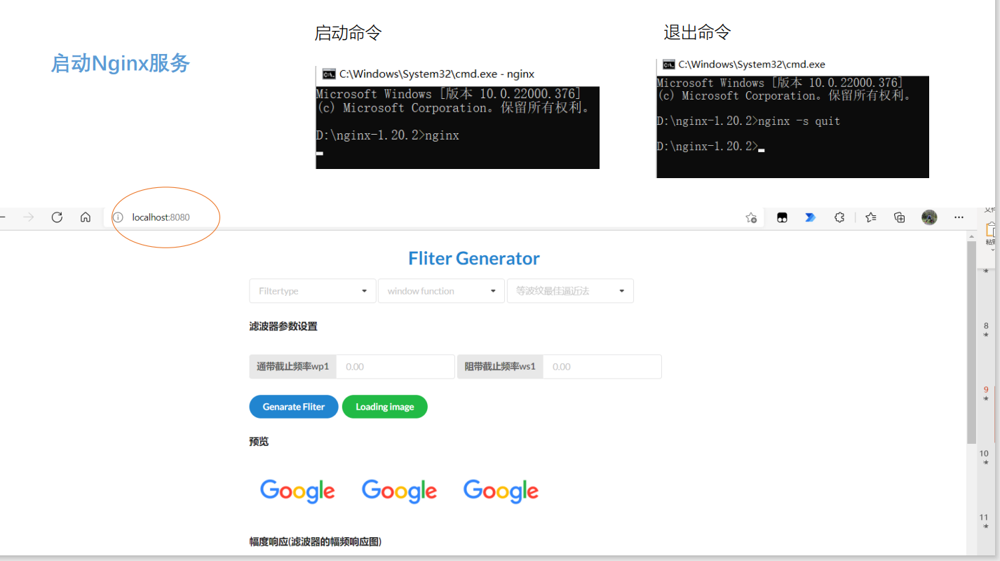
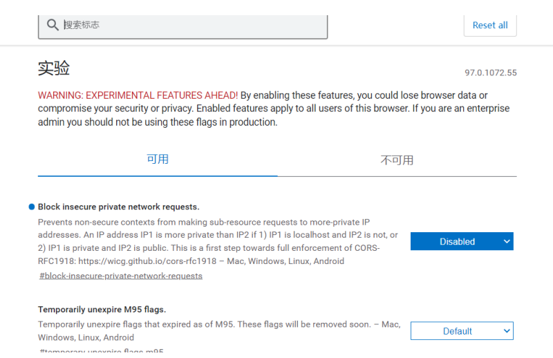

[TOC]

# -MATLAB-Web-App-Server-

本项目是为有效解决当前MATLAB Web App Server部署web应用后加载极其缓慢，且无法兼容chrome49内核浏览器，无法进行三方优化等痛点创建。

**目前部署MATLAB Web App 到云端有两种方案：**

（1）使用官方提供的MATLAB Web App Server工具或MATLAB Production Server工具完成部署；

（2）通过本仓库的方法实现（以下两种方法总体思想相同，实现方式不同）。

# -视频详解

# -方法详致解说

## -方法一

## -方法二

示意图：

> **Backend**

- **后端主程序：**后端使用`Python`作为开发语言，因为`MATLAB`提供给`Python`一个`MATLAB engine API`的包供 `Python `将 `MATLAB `作为计算引擎来调用；

- **后端框架：**后端使用`python`的三方库`fastapi`作为后端异步框架，供予前后端异步交流；

- **后端服务器：**后端采用轻量快速的 `Python ASGI `框架 `Uvicorn`作为异步服务器使用。

> **Frontend**

- **前端：**这里使用的`Semantic UI`作为前框框架绘制页面，选择`jQuery`作为`JavaScript`库编写应用函数，使用`vue`前端框架创建于后端连接的`RESTful API`。

> **Nginx Server**

**Nginx服务器**：用于部署静态资源，如主页面`index.html`、`semantic UI.css`、`jquert.js`以及默认加载图片等都是存储在该服务器上，用户访问的页面就是从该服务器获取的。同时该服务还会接收后端调用`m脚本`后生成的其它资源，如图片等。

**概括**：用户通过浏览器访问目标地址，目标地址通过`nginx`服务器反馈相关静态资源呈现在浏览器上，当用户对其操作并向后端发送请求后，后端`main.pyton`通过调用同级目录下的`m文件`实现计算，计算后后端程序将数值数据直接反馈给浏览器，将图片等其它资源保存至`Nginx`服务器端，用户在浏览器上通过`加载图片`按钮，向`Nginx`服务器发送请求，获取图片资源。

### Nginx配置

**配置信息**：主要是监控端口和绑定的ip地址

下面是后端程序、Nginx服务器、以及NAT对地址的设置

其中cmygvy.natappfree.cc是外网访问目标页面的地址；192.168.3.7是本机ipv4地址；

**启动方法**：命令行启动与关闭

### 浏览器设置

因为存在跨域安全问题，这里需要在浏览器地址栏搜索chrome://flads进入设置，然后将Block insecure private network requests`改为`disabled`。

### 后端配置

后端最好将主程序main.py和matlab的m文件放在同一目录下，否则偶尔会出现matlab engine找不到根路径的问题，需要强制cd到指定目录。

### 存在问题

（1）在多台主机测试的时候发现，两台主机必须处于同一wifi下，

下面不行

